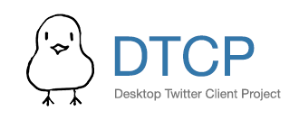

[](https://travis-ci.org/alchen/DTCP)

DTCP is a Twitter client built with [`electron`][1] and [`Vue.js`][2]. Futher development has **discontinued** as of Aug 2018 because of the recent Twitter API changes that made impposible for 3rd-party client to provide a good experience to the end users.

**And a new Mastodon app will be coming soon at [Rusk.app](https://rusk.app).**

[](docs/screenshot_1.png)[](docs/screenshot_2.png)

# Downloads

[ OS X](https://github.com/alchen/DTCP/releases/download/v0.6.0/DTCP-mac.zip)

[ Windows](https://github.com/alchen/DTCP/releases/download/v0.6.0/DTCP-win32.zip)

# Development

```
npm install  # Install dependencies
gulp         # Bundle up javascript files and style sheets
npm start    # Start the program with electron-prebuilt
```

[1]:https://github.com/atom/electron
[2]:https://github.com/vuejs/vue
