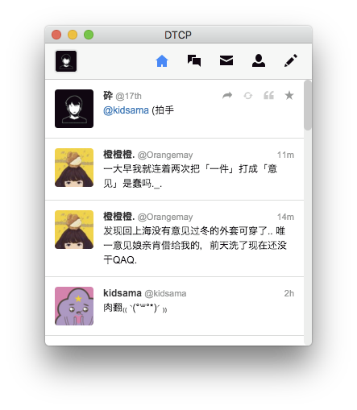
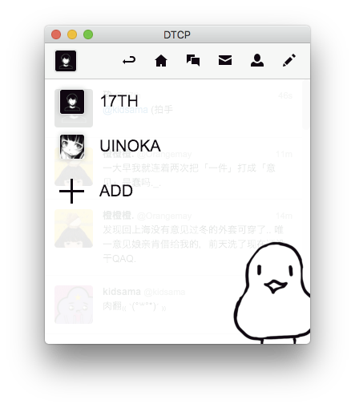

[](https://travis-ci.org/alchen/DTCP)

DTCP is a Twitter client based on [`electron`][1].

[](docs/screenshot_1.png)[](docs/screenshot_2.png)

# Downloads

[ OS X](https://github.com/alchen/DTCP/releases/download/v0.4.4/DTCP-mac.zip)

[ Windows Installer](https://github.com/alchen/DTCP/releases/download/v0.4.4/DTCP-win32.zip)

# Development

```
npm install  # Install dependencies
gulp         # Bundle up javascript files and style sheets
npm start    # Start the program with electron-prebuilt
```

# Questions

You can always find me at [@uinoka](https://twitter.com/uinoka).

[1]:https://github.com/atom/electron
